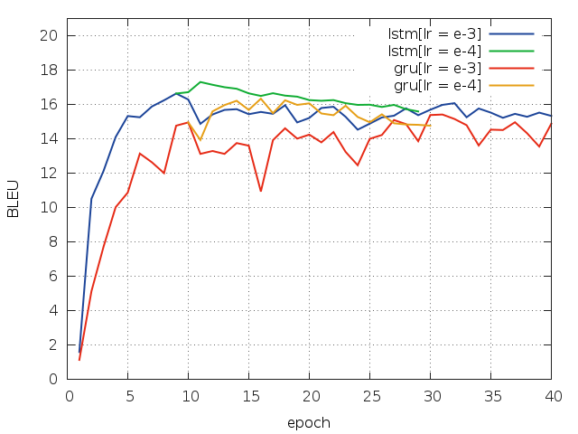

## Sequece-to-Sequence Model with attention

Sequence-to-sequence model with attention implemented by [Torch](http://torch.ch). The convolutional attentive encoder([Rush et al.](https://www.aclweb.org/anthology/D/D15/D15-1044.pdf)) inspired by [Bahdanau et al.](https://arxiv.org/pdf/1409.0473v7.pdf) is provided. Additionally, the encoder can be bidirectional recurrent neural network(LSTM | GRU | RNN). 

### Dependencies

#### Lua
* [Moses](https://github.com/Yonaba/Moses)
* [Penlight](https://github.com/stevedonovan/Penlight)

#### Torch
The model is implemented by [torch](http://torch.ch). It requires the following packages:
* [torch](https://github.com/torch/torch7)
* [nn](https://github.com/torch/nn)
* [nngraph](https://github.com/torch/nngraph)
* [cutorch](https://github.com/torch/cutorch)
* [cunn](https://github.com/torch/cunn)
* [optim](https://github.com/torch/optim)
* [paths](https://github.com/torch/paths)

### Quikstart

#### preprocess

* First, I pre-process the training data using the tokenizer of the Moses toolkit with the script `nmt-prep.sh` in `script/` folder.
```
sh nmt-prep.sh
```

* And then, prepare the data with `data_prep.lua` which transforms the data into tensor.
```
th data_prep.lua 
```

#### train
Now, start to train the model
```
th main.lua -learningRate 0.001 -optim 'adam' -dropout 0.2 -rnn 'lstm'
```
This will run the model, which uses convolutional attentive encoder and a 1-layer LSTM decoder with 256 hidden units. 

#### evaluate

* Given a trained model, use beam search to obtain the output. Additionally, greedy search is also provided for efficiency. To do this, just run as follows:
```
th evaluate.lua -search 'greedy' -batch_size 32
```

* I use the `muti-bleu.perl` script from Moses to compute the BLEU. Given the *identifier* of model and *gpuid*, just run as follows:
```
sh nmt-eval.sh identifier gpuid
```
Note that the testing dataset is grouped by the length with `nmt-prep.lua`, so the predicitons doesn't match raw source text. In addition to the predictions, add line number of source sequence in raw text. Before computing the BLEU, leverage the line number to sort the predictions, making the predicitions match the golden sequences.

When use convolutional attentive encoder and a 1-layer LSTM decoder with 256 hidden units, the BLEU curves with greedy search on test dataset is as below. 



### Details

#### data preprocess options(`data_prep.lua`)
* `src_path`: path to pre-processed data with `script/*-prep.sh`
* `dst_path`: path to store the dictionaries and datasets. And they are transfored into tensor format from raw text format. 
* `src_train, src_valid, src_test`: the name of source sequences
* `tgt_train, tgt_valid, tgt_test`: the name of target sequences
* `min_freq`: Replace the token occurring this value with `UNK` token
* `seed`: torch manual random number generator seed.

#### training options(`main.lua`)
**Data options**

* `data`: path to the training data, which is output of `data_prep.lua`
* `src_dict, tgt_dict`: the dictionaries of source and target sequences
* `thresh`: the minimum tokens of target sequences at same length. If less than this value, don't use these sequence to train model
* `reverse`: If `true`, reverse the source sequences
* `shuff`: If `true`, shuff the sequences
* `curriculum`: the number of epochs at which perform curriculum learning. And the input is sorted by length 

**Model options**

* `model`: If not empty, load the pre-train model with this name
* `emb`: the dimension of word embeddings
* `enc_rnn_size`: the size of recurrent hidden states in encoder
* `dec_rnn_size`: the size of recurrent hidden states in decoder
* `rnn`: the name of recurrent unit(`LSTM` | `GRU` | `RNN`)
* `nlayer`: the number of layers in the recurrent encoder and decoder
* `attn_net`: the name of attention network(`conv` | `mlp`). use convolutional attentive encoder with option `conv`, and multi-layer perception with option `mlp`
* `pool`: the pool size of attention convolutional encoder

**Optimization options**

* `optim`: the name of optimization algorithm
* `dropout`: the dropout rate
* `learningRate`: the learning rate of optimization algorithm
* `minLearningRate`: the minimum of learning rate
* `shrink_factor`: decay the learning rate by this if the loss doesn't decrease to the product of the previous loss and `shrink_muliplier`. And it only works when the option `optim` is sgd.
* `shrink_multiplier`: the shrink multiplier
* `anneal`: If `true`, anneal the leanring rate
* `start_epoch`: the epoch at which start to anneal the learning rate
* `saturate_epoch`: the number of epoch after which learning rate anneals to `minLearningRate` from `start_epoch`
* `batch_size`: the size of mini-batch
* `src_seq_len, tgt_seq_len`: the minimum length of source/target sequences, and truncate the sequences whose length is bigger than this length
* `grad_clip`: clip the gradients which is bigger than this value
* `nepoch`: the maximum of epochs 

**Other options**

* `save`: the path to save the model.
* `name`: the identifier of the training models. And it is substring of the name of models
* `seed`: torch manual random number generator seed
* `cuda`: If `true`, use cuda
* `gpu`: the ID of gpu to use
* `nprint`: the frequency of print the information

#### evaluate options(`evaluate.lua`)
**Data Options**

* `data`: the path to testing datasets
* `src_dict, tgt_dict`: the dictionaries of source and target sequences
* `thresh`: the minimum tokens of target sequences at same length. If less than this value, don't use these sequence to train model
* `reverse`: If `true`, reverse the source sequences

**Model options**

* `model`: the name of model to test

**Search options**

* `search`: the serach strategy('beam' | 'greedy')
* `batch_size`: the size of min-batch if `search` options is 'greedy'
* `beam_size`: the size of beam if `search` option is 'beam'
* `src_seq_len, tgt_seq_len`: the minimum length of source/target sequences, and the sequences whose length is bigger than this length, truncate
* `strategy`: If `true`, the prediction is simply the top sequence of beam with an `<EOS>` tail token at the first time. Otherwise, the model considers all sequences that have been generated so far that end with `<EOS>` token and takes the top sequences
* `nbest`: If `true`, output the n-best list, when `search` option is 'beam'

**Other options**

* `save`: the path to save the model
* `output`: the path save the predicions of the model
* `seed`: torch manual random number generator seed
* `cuda`: If `true`, use cuda
* `gpu`: the ID of gpu to use
* `nprint`: the frequency of print the information

### Acknowledgements

My implementation utilizes code from the following:

* [Andrej Karpathy's char-rnn repo](https://github.com/karpathy/char-rnn)
* [harvardnlp's seq2seq-attn repo](https://github.com/harvardnlp/seq2seq-attn)
* [facebook research's Mixer repo](https://github.com/facebookresearch/MIXER)
